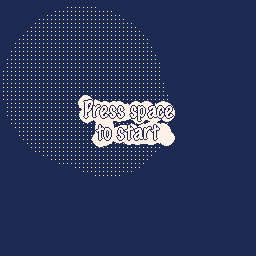

# One Light For Three Seconds

🧠 In this game, players must navigate through intricate mazes with a limited time frame to reach the exit. The catch? You only have a mere 3 seconds to memorize the maze layout before attempting to guide your player through it.

🎮 After the brief memorization phase, the maze disappears, and the player must guide their character to the exit using arrow keys for ◀️ left, ▶️ right , 🔼 up, and 🔽 down movements.

💪 The challenge lies in recalling the maze's layout from memory and making swift decisions to avoid obstacles and reach the exit before time runs out.

## Play this game

This game was created during the Trijam 256 (The 3 hour game jam) with the theme *only three*.
It was also submitted during the Micro Jam 004 with the theme *Light* 

[You can play the game on itch.io](https://dwursteisen.itch.io/one-light-for-three-seconds) : __Have fun__ !

## Game Engine

This game was build using my own game engine [🧸 Tiny](https://minigdx.github.io/tiny/index.html), in around 3 hours (Levels, sound, sprites...)

Try [🧸 Tiny online](https://minigdx.github.io/tiny/sandbox.html?game=CiAgCmZ1bmN0aW9uIF9kcmF3KCkKICAgIGdmeC5jbHMoKQoKICAgIHByaW50KCJSZWN0YW5nbGUgbGltaXQiLCA2NCwgNjQgLSA1KQogICAgLS0gZHJhdyB0aGUgYm9yZGVyIGxpbWl0LgogICAgZ2Z4LmRpdGhlcigweEE1QTUpCiAgICBzaGFwZS5yZWN0KDY0LCA2NCwgMjU2IC0gMTI4LCAyNTYgLSAxMjgsIDIpCiAgICBnZnguZGl0aGVyKCkKCiAgICAtLSBkcmF3IHRoZSBtb3VzZSBwb3NpdGlvbi4KICAgIGxvY2FsIHBvcyA9IGN0cmwudG91Y2goKQogICAgc2hhcGUubGluZShwb3MueCAtIDIsIHBvcy55LCBwb3MueCArIDIsIHBvcy55LCAzKQogICAgc2hhcGUubGluZShwb3MueCwgcG9zLnkgLSAyLCBwb3MueCwgcG9zLnkgKyAyLCAzKQoKICAgIC0tIGRyYXcgdGhlIHJlY3RhbmdsZSB0aGF0IGlzIHN0YXlpbmcgd2l0aGluIHRoZSBib3JkZXIgbGltaXQuCiAgICBsb2NhbCB4ID0gbWF0aC5jbGFtcCg2NCwgcG9zLnggLSA0LCAyNTYgLSA2NCAtIDkpCiAgICBsb2NhbCB5ID0gbWF0aC5jbGFtcCg2NCwgcG9zLnkgLSA0LCAyNTYgLSA2NCAtIDkpCiAgICBzaGFwZS5yZWN0KHgsIHksIDksIDksIDgpCmVuZAo=) before using it for your next project 😆 !